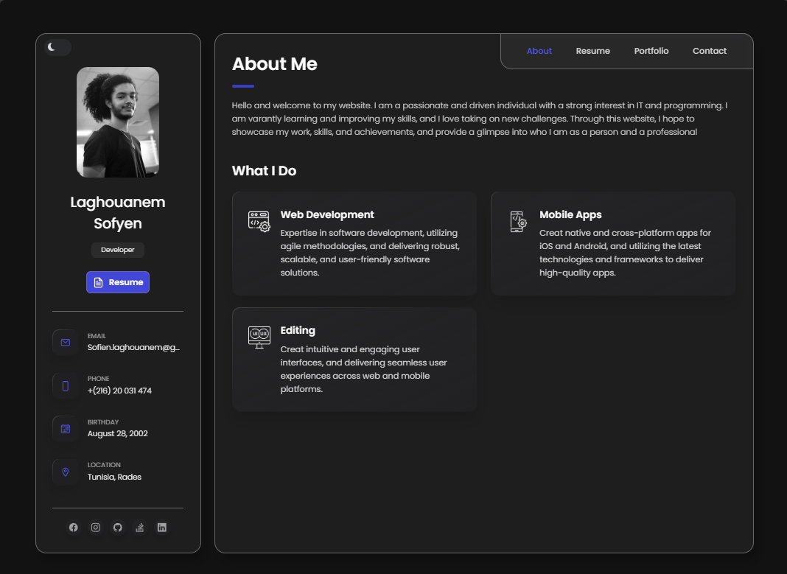
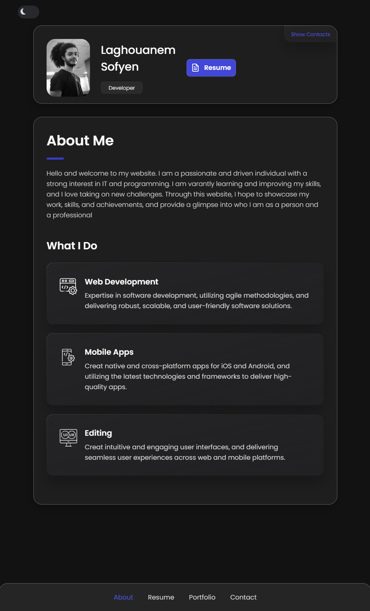

# **Portfolio Project - CodeWizard-404**

Welcome to my **Portfolio** project repository! This is my personal portfolio website, designed to showcase my work, skills, and accomplishments as a developer. It serves as a vibrant and interactive digital resume to give potential clients, employers, and fellow developers a comprehensive view of what I can do.

---


## **✨ Overview**

This portfolio is designed to reflect my journey as a developer and my passion for creating elegant, user-friendly web applications. The website is a dynamic and animated interface, making it an engaging and modern platform to explore my projects, skills, and background.

It includes a range of interactive elements, smooth scrolling, animations, and transitions that enhance the overall user experience. Additionally, this site is responsive, ensuring that it works seamlessly across a variety of devices, from desktops to tablets and mobile phones.

---

## **🔧 Features**

- **Interactive UI:** Beautiful transitions and hover effects on the homepage.
- **Responsive Design:** Optimized for all screen sizes with a mobile-first approach.
- **Project Showcase:** A section that dynamically displays all of my recent projects.
- **About Me Section:** A detailed personal section with a visual timeline of my career.
- **Contact Form:** A fully functional form to reach out directly through email.
- **Social Media Integration:** Links to my professional profiles (LinkedIn, GitHub, etc.).
- **Custom Animations:** Smooth animations that bring the site to life.

---

## **💻 Tech Stack**

This project utilizes a modern stack of tools and technologies to create a seamless and enjoyable user experience. Here are the primary technologies used:

- **HTML5:** The basic structure of the site, ensuring semantic HTML elements for accessibility.
- **CSS3:** For custom styles and design, including CSS animations and transitions.
- **JavaScript:** Used for interactive features and dynamic content loading.
- **Webpack:** Bundles the frontend code into optimized files for production.
- **SASS/SCSS:** For writing clean, reusable stylesheets.
- **Git:** For version control, keeping track of all changes made to the project.


---

## **⚙️ Installation & Setup**

Follow these steps to get your development environment up and running:

### **1. Clone the repository:**

First, clone the repository to your local machine using:

```bash
git clone https://github.com/CodeWizard-404/Portfolio.git
```

### **2. open project:**

Navigate to the project folder :

```bash
cd Portfolio
index.html
```

This will start the server on `http://localhost:3000` (or the port specified in your configuration file). Open this URL in your browser to see the portfolio in action!

---

## **🔍 Usage**

Once the website is up and running, you’ll be able to explore:

- **The About Me section:** Find out more about my background, skills, and experience.
- **Projects Showcase:** View some of my most recent work and the technologies used in each project.
- **Interactive Timeline:** See my career progress and milestones in a fun and engaging format.
- **Contact Form:** Feel free to reach out to me directly through the contact form.
- **Animations:** Enjoy the smooth transitions and hover effects.

The portfolio is designed with a clean layout to ensure that all content is easy to navigate and view. You can click on each project in the Projects Showcase to see detailed descriptions and links to the live projects or GitHub repositories.

---

## **📸 Screenshots**

Here are some screenshots from the live portfolio website:



*Example of the homepage with smooth transitions and interactive elements.*



*Responsive design on mobile view showing a minimalistic approach.*

---

## **🛠️ Contributing**

Contributions to this repository are welcome! Feel free to fork the repository, make changes, and create a pull request with your improvements. Here are a few ways you can contribute:

- Fixing bugs
- Improving documentation
- Adding new features (like additional animations, new projects, etc.)
- Enhancing the UI/UX

Please ensure that all contributions adhere to the following guidelines:

1. **Follow the coding standards:** Keep the code clean, modular, and well-documented.
2. **Test your changes:** Make sure that any new functionality works as expected and doesn’t break existing features.
3. **Commit messages:** Write meaningful commit messages that describe the changes made.

---

## **📝 License**

This project is licensed under the MIT License. See the [LICENSE](LICENSE) file for more details.

---

## **📬 Contact**

Feel free to contact me via any of the following methods:

- **Email:** sofienlaghouanem@gmail.com
- **GitHub:** [CodeWizard-404](https://github.com/CodeWizard-404)
- **LinkedIn:** [Sofyen Laghouanem](https://www.linkedin.com/in/Sofyen-laghouanem)
- **Instagram:** [@Sofyen.Laghouanem](https://www.instagram.com/Sofyen.Laghouanem)

---

Thank you for visiting my portfolio. I hope you enjoyed exploring my work and learning more about my journey as a developer. If you have any questions or feedback, don’t hesitate to reach out!

